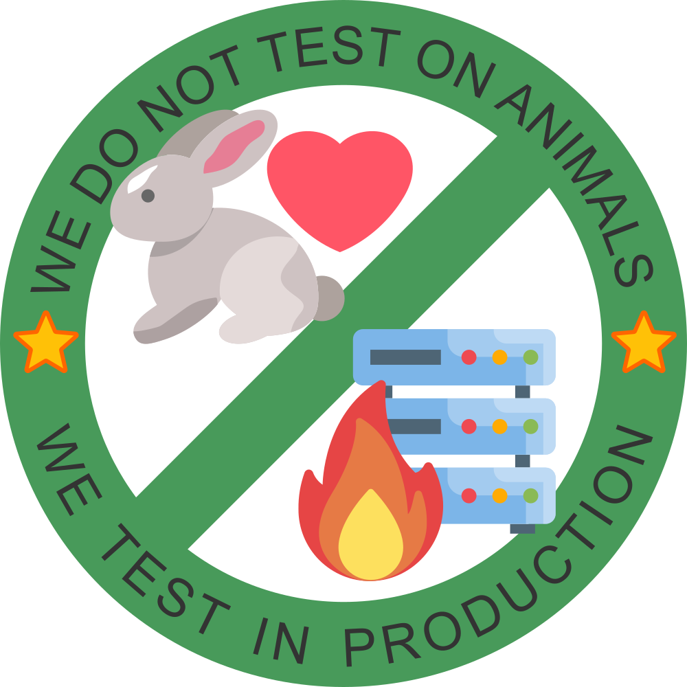

# echo Web

<div aling="center" style="display: flex; align-items: center; gap: 30px; margin: 10px auto; max-height: 150px;">
  
  <a href="https://sanity.io" target="_blank" rel="noopener">
    
  </a>
  <a href="https://vercel.com/?utm_source=echo-webkom&utm_campaign=oss" target="_blank" rel="noopener">
    
  </a>
</div>

Full-stack monorepo for nettsiden til **echo – Linjeforeningen for informatikk** ved Universitetet i Bergen.

Utviklet av frivillige informatikkstudenter fra undergruppen **echo Webkom**.

## Tilbakemeldinger

Har du noen tilbakemeldinger til nettsiden?
Vi jobber hele tiden med å forbedre den,
og setter stor pris på om du sier ifra om noe er feil,
eller du har idéer til nye endringer!

Send oss gjerne en tilbakemelding via skjemaet på https://echo.uib.no/tilbakemelding,
eller send oss en mail på [webkom-styret@echo.uib.no](mailto:webkom-styret@echo.uib.no).

## Hvordan kjøre?

Først forventer vi at du har installert alle "dependencies" og lagt til `.env` slik det er vist under.

1. Kopier `.env.example` til `.env` og fyll inn nødvendige verdier.

   ```sh
   cp .env.example .env
   ```

1. Last ned "dependencies"

   ```sh
   pnpm install
   ```

1. Sette opp databasen

   ```sh
   pnpm db:setup
   ```

1. Synce og seede databasen

   ```sh
   pnpm seed
   ```

1. Start utviklingsmiljøet

   ```sh
    pnpm dev
   ```

Sidene som starter er:

- [http://localhost:3000](http://localhost:3000) for nettsiden
- [http://localhost:3333](http://localhost:3333) for Sanity Studio
- [https://local.drizzle.studio](https://local.drizzle.studio) for Drizzle Studio

NB: "Backenden" til Drizzle vil kjøre på [http://localhost:4983](http://localhost:4983).

## Relaterte prosjekter

- [boomtown](https://github.com/echo-webkom/boomtown) - Systemet for live oppdatering av påmeldinger på arrangementer.
- [ews](https://github.com/echo-webkom/ews) - CRON-jobber for nettsiden.
- [kaffe](https://github.com/echo-webkom/kaffe)

## Dokumentasjon

[Du kan lese mer på vår wiki!](https://docs.echo-webkom.no)
