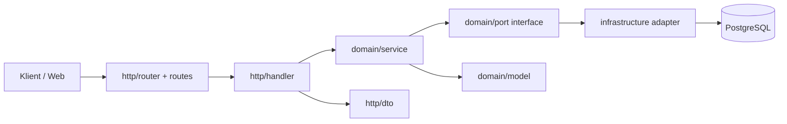

Denne siden beskriver hvordan `apps/uno` er organisert, hvorfor strukturen ser slik ut, og hvordan du implementerer en ny feature uten å bryte lagdelingen.

I Uno bruker vi en hexagonal arkitektur for å holde domenelogikk uavhengig av eksterne systemer. Dette gjør vi for å sikre at kjernefunksjonalitet kan utvikles, testes og vedlikeholdes uten å være bundet til spesifikke teknologier eller infrastrukturer.

For nye utviklere kan dette virke komplekst, og være utfordrende å forstå i starten, men vi har gjort dette valget bevisst for å oppnå bedre modularitet, testbarhet og vedlikeholdbarhet. Vi ønsker at dette skal være en bulletproof backend for echo som kommer til å vare lenge.

## Mål med arkitekturen

- Holde domenelogikk uavhengig av HTTP, database og tredjepartssystemer
- Gjøre kode lettere å teste med mocks og porter
- Redusere kobling mellom transportlag og forretningslogikk

## Lagdeling i Uno

### 1) Inbound lag (`http/`)

- Router og route-registrering
- Handler som parser input og returnerer HTTP-respons
- DTO-er for request/response-formater

Dette laget vet om HTTP, men skal ikke inneholde forretningsregler.

### 2) Domene lag (`domain/`)

- `model/` med kjernetyper
- `port/` med interfaces domenet trenger
- `service/` med business logic

Dette laget kjenner ikke til database-drivere, HTTP-framework eller infrastrukturdetaljer, men inneholder all business logic og regler.

### 3) Infrastruktur lag (`infrastructure/`)

- Implementasjoner av porter fra domenet
- Postgres-repositories
- Logging, telemetry og eksterne klienter

Dette laget er stedet for konkrete adaptere mot omverdenen.

### 4) Bootstrap (`bootstrap/` og `cmd/*`)

- Setter sammen dependencies
- Kobler service-implementasjoner til handler/router
- Starter prosesser for `web`, `cron` og `worker`

## Request flow

1. Request treffer route i `http/routes/...`
2. Handler validerer input og kaller riktig service i `domain/service/...`
3. Service bruker porter i `domain/port/...`
4. Infrastruktur implementerer portene i `infrastructure/...`
5. Resultat går tilbake til handler som mapper til HTTP-respons

## Arkitekturdiagram



Kort lest:

- Inbound: `router/routes` -> `handler`
- Kjerne: `domain/service` + `domain/model` + `domain/port`
- Outbound: `infrastructure/*` -> databaser/eksterne tjenester

## End-to-end eksempel: ny feature

Eksempel: legg til `GET /happening/:id` for å hente info om en happening.

### Steg 1: Domene modell

Opprett/utvid modell i `apps/uno/domain/model/...`:

```go
type Happening struct {
    ID    string
    Name  string
    Time  time.Time
}
```

### Steg 2: Port i domenet

Definer hva domenet trenger i `apps/uno/domain/port/...`:

```go
type HappeningRepository interface {
    GetHappeningByID(ctx context.Context, id string) (*model.Happening, error)
}
```

### Steg 3: Service-implementasjon

Implementer use-case i `apps/uno/domain/service/...`:

```go
type HappeningService struct {
    repo port.HappeningRepository
}

func (s *HappeningService) GetByID(ctx context.Context, id string) (*model.Happening, error) {
    if id == "" {
        return nil, ErrInvalidHappeningID
    }
    return s.repo.GetHappeningByID(ctx, id)
}
```

### Steg 4: Infrastruktur-implementasjon

Implementer porten i `apps/uno/infrastructure/postgres/...`:

- SQL/query mapping
- Konvertering mellom DB-modell og domene-modell
- Håndtering av feil i databasen

### Steg 5: HTTP handler og route

Legg handler i `apps/uno/http/handler/...` og route i `apps/uno/http/routes/...`:

```go
// GetHappeningById returns a happening by its ID
// @Summary	     Get happening by ID
// @Description  Retrieves a specific happening by its unique identifier.
// @Tags         happenings
// @Produce      json
// @Param        id   path      string  true  "Happening ID"
// @Success      200  {object}  dto.HappeningResponse  "OK"
// @Failure      400  {string}  string  "Bad Request"
// @Failure      404  {string}  string  "Not Found"
// @Router       /happenings/{id} [get]
func (h *happenings) GetHappeningById(ctx *handler.Context) error {
	// Extract the happening ID from the URL path
	id := ctx.PathValue("id")

	// Fetch the happening from the repository
	hap, err := h.happeningService.GetByID(ctx.Request().Context(), id)
	if err != nil {
		return ctx.Error(errors.New("happening not found"), http.StatusNotFound)
	}

	// Convert domain model to DTO
	response := new(dto.HappeningResponse).FromDomain(&hap)
	return ctx.JSON(response)
}
```

Kommentarene i over funksjonen er for OpenAPI-dokumentasjon og gir en klar beskrivelse av hva endpointet gjør, hvilke parametere det forventer, og hvilke responser det kan returnere.

Vi forventer at alle handler-funksjoner har slike kommentarer for å sikre god dokumentasjon og konsistens i API-et.

### Steg 6: Wiring i bootstrap

Koble sammen repository -> service -> handler i `apps/uno/bootstrap/...`.

Uten dette steget blir ikke ny route operativ.

## Designregler vi følger

- Domene-laget skal ikke importere pakker fra `http/` eller `infrastructure/`. Det burde være så uavhengig som mulig.
- Handler skal være tynne: parsing, auth-sjekk, service-kall, response mapping
- Services skal inneholde forretningsregler, ikke SQL eller HTTP-detaljer
- Infrastruktur skal implementere porter, ikke egen forretningslogikk
- Bruk eksisterende modeller/porter før du lager nye abstraheringer
- Ved veldig enkle queries kan man bare returnere repoet i services. Dette er situasjoner hvor det er liten til ingen business logic, og det ikke er sannsynlig at det vil vokse til mer kompleksitet senere. Eksempel: `GetHappeningByID` som vist over.

## Testing per lag

- `domain/service`: raske unit tester med mocks fra `domain/port/mocks`
- `http/handler`: tester request/response og statuskoder
- `infrastructure/postgres`: integrasjonstester mot database der det trengs

Kjør:

```bash
pnpm --filter=@echo-webkom/uno test
```

## Vanlige feil

- For mye logikk i handler i stedet for service
- Direkte DB-kall fra `http/` lag
- Nye interfaces uten tydelig behov
- Manglende wiring i `bootstrap`, så endpointet svarer aldri
